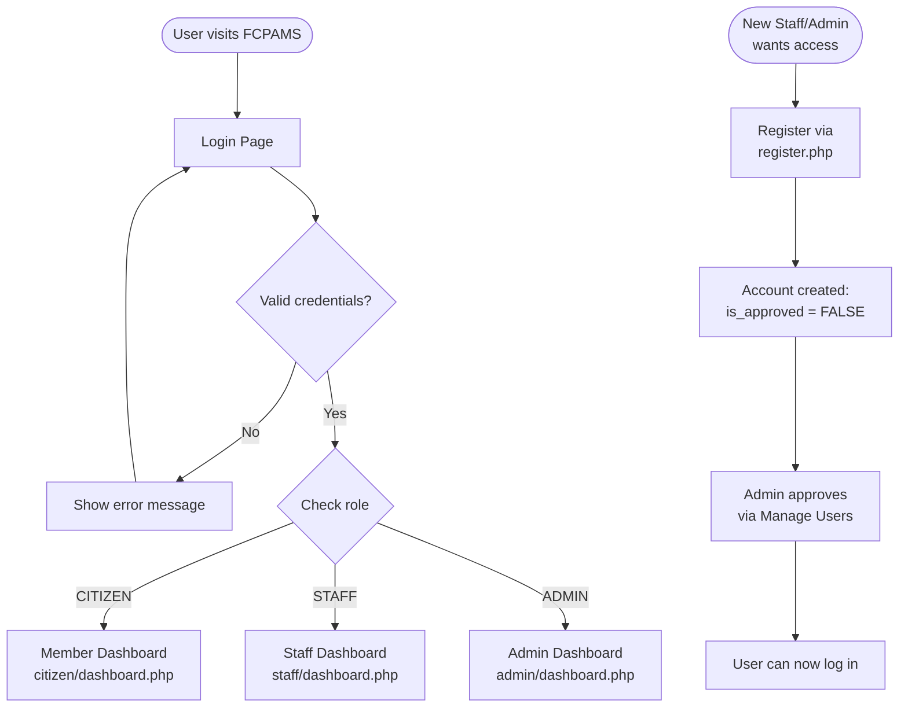
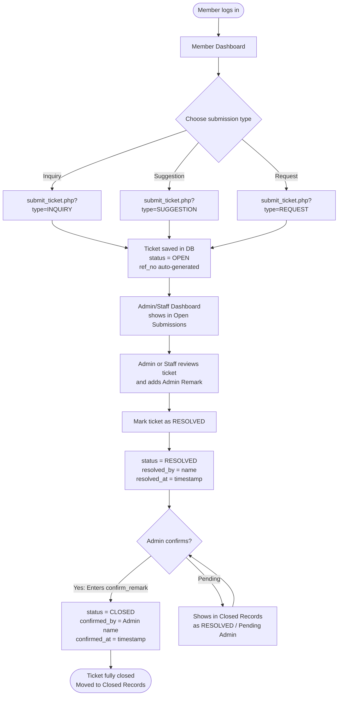
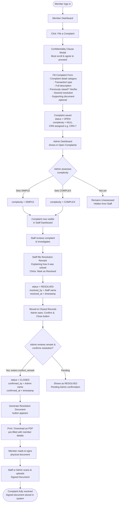
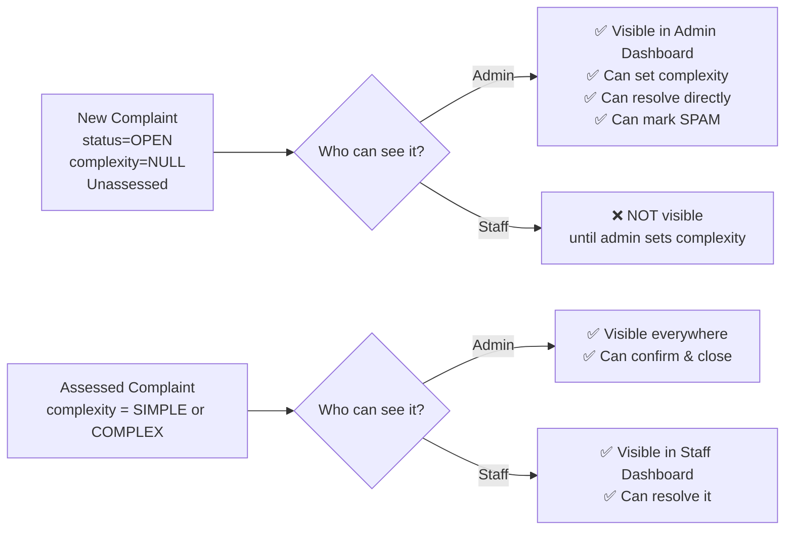
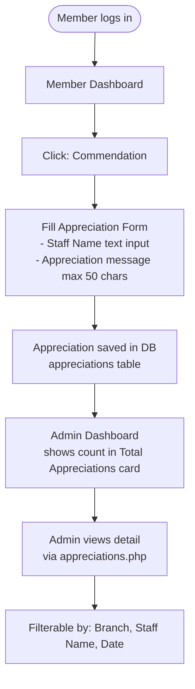
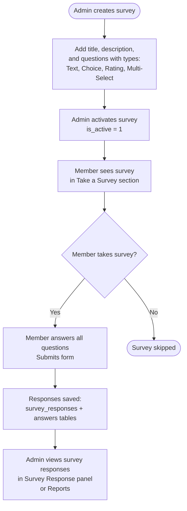

# FCPAMS — Feedback, Complaint, and Participation Administration Management System
## System Process Document & Flow Guide

**Organization:** Bansalan Cooperative  
**System Version:** 2.0  
**Document Type:** Process Flow Reference  
**Last Updated:** July 6, 2026

---

## 1. System Overview

FCPAMS (also formally known as the **Members Financial Consumer Protection Assistance Management System**) is a web-based management system deployed for Bansalan Cooperative. It allows **Members (Citizens)** to submit inquiries, suggestions, requests, complaints, and commendations/appreciations, as well as to take surveys. **Staff** resolves cases, and **Admins** oversee, triage, confirm, and archive all records.

The system is built in **PHP** with a **MySQL/MariaDB** database and is hosted on XAMPP/Apache.

---

## 2. User Roles

The system has **three distinct user roles**, each with a separate login session and dashboard.

| Role | Registration | Access Level | Primary Purpose |
|---|---|---|---|
| **CITIZEN** (Member) | Self-registered via `register.php` | Citizen Portal | Submit concerns, take surveys, commend staff |
| **STAFF** | Registered & approved by Admin | Staff Panel | Investigate and resolve complaints & submissions |
| **ADMIN** | Registered & approved by Admin | Admin Panel | Full system management, triage, confirmation, reports |

> [!NOTE]
> **Admin can access Staff pages.** The `auth_guard('STAFF')` check allows both STAFF and ADMIN roles through. Citizens cannot access staff or admin pages, and vice versa.

---

## 3. Detailed Role Responsibilities & Problem-Solving

### 🙎‍♂️ Member (Citizen)
**Goal:** Report issues, seek assistance, give feedback, and recognize good service.

- **Filing a Complaint:** The member navigates to the citizen dashboard and clicks "File a Complaint." Before accessing the form, they must read and scroll through a **Confidentiality Clause modal** (RA 10173 / Data Privacy Act of 2012) and click "I Agree & Proceed."
- **Complaint Form Fields:** Complaint detail (from dropdown), transaction type (from dropdown), full description, whether previously raised, desired resolution, and an optional supporting document (JPG/PNG/PDF, max ~5MB). Fields marked "PHYSICAL INFRASTRUCTURE" or "OTHER" trigger a free-text specific detail input.
- **Submitting Tickets (ISR):** Members submit Inquiries, Suggestions, and Requests through a unified `submit_ticket.php` form, which pre-selects the type via URL parameter.
- **Submitting a Commendation:** Members can recognize a specific staff member through the "Commendation / Appreciation" form. They enter the staff name and a short appreciation message (max 50 characters).
- **Taking a Survey:** Members browse available active surveys and answer all questions, which may include text, multiple choice, rating, or multi-select types.
- **Accepting Resolution:** After a complaint is CLOSED, the member physically signs the printed "Acceptance and Settlement of Complaint Resolution" document.

### 👨‍💻 Admin
**Goal:** Triage issues, confirm resolutions, enforce policy, manage the system, and maintain records.

- **Triage (Complexity Gating):** When a new complaint arrives, it is visible in the Admin dashboard with status `OPEN` and complexity `NULL` (Unassessed). The Admin reads the complaint and sets the complexity:
  - **SIMPLE:** Straightforward issues staff can handle directly.
  - **COMPLEX:** Serious issues requiring investigation or management intervention.
  - Setting complexity makes the complaint visible to Staff.
- **Quality Control:** When Staff marks a complaint as RESOLVED, the Admin reviews the Resolution Remark and, if satisfied, enters a "Resolution of Complaint" remark and clicks **Confirm & Close**.
- **Document Generation:** After closing, Admin generates the official **Acceptance and Settlement of Complaint Resolution** document (pre-filled with member info), which is printed and signed by the member.
- **Signed Document Upload:** Admin or Staff scans and uploads the signed document back into the system.
- **Spam Management:** Admin can mark any submission or complaint as SPAM from both the dashboard and the detailed view, removing it from the main working queue.
- **User Management:** Admin approves new Staff/Admin registrations and can change user roles or delete accounts (cannot delete their own account).
- **Branch Management:** Admin adds, removes, and classifies branches as **Regular Branch** or **Head Office (HO) Branch** using the `is_ho` toggle.
- **Category Management:** Admin controls all dropdown options shown in citizen forms via the "Manage Categories" (`dropdowns.php`) page, covering: Inquiry Categories, Suggestions/Concern, Request Categories, Complaint Details, and Transaction Types. Options can be added, edited inline (via prompt), or deleted.
- **Survey Management:** Admin creates surveys with questions (Text, Choice, Rating, Multi-Select), activates/deactivates them, and views all responses.
- **Reports:** Admin generates printable reports for Complaints, Submissions, and Survey Responses.
- **Appreciations:** Admin views all commendations submitted by members, filterable by branch, staff name, and date.

### 🧑‍💼 Staff
**Goal:** Investigate, communicate, and solve the actual problems reported by members.

- **Visibility:** Staff only see complaints that have been assessed by Admin (complexity = SIMPLE or COMPLEX). Unassessed complaints are hidden.
- **Investigation:** Staff monitor their dashboard for open complaints and submissions. They review the member's description, any uploaded supporting documents, and complaint metadata.
- **Resolution:** Staff performs the actual resolution work (contacting the branch, checking transaction logs, calling the member, etc.), then writes a detailed **Resolution Remark** in the system and clicks "Mark as Resolved."
- **Submissions:** Staff can also resolve Inquiry, Suggestion, and Request submissions.
- **Closed Records:** Staff can view the Closed Records archive to see what has already been resolved and confirmed.

---

## 4. Authentication & Registration Flow



> [!IMPORTANT]
> **Citizens register separately** via `register.php` and their accounts are stored in the `citizens` table. Staff/Admin accounts are stored in the `users` table and **require Admin approval** before they can log in.

---

## 5. Submission (Ticket) Flow

Covers: **Inquiry, Suggestion, Request**



> [!NOTE]
> **Reference Number:** Each ticket gets an auto-generated `ref_no` in the format `[TYPE]-YYYY-XXX` (e.g., `INQ-2026-001`). This is visible in the submission detail view.

---

## 6. Complaint Flow *(Core Process)*



---

## 7. Complaint Visibility Rules



> [!IMPORTANT]
> A complaint with `complexity = NULL` (Unassessed) is **invisible to Staff**. Admin must set the complexity before staff can process it. The admin can change complexity inline directly from the Complaints list view using a dropdown that auto-submits.

---

## 8. Commendation / Appreciation Flow *(New Feature)*



**Appreciation Form Rules:**
- Staff name is a free-text field (typed by the member).
- Appreciation message has a **50-character hard limit** enforced both client-side (live counter) and server-side.
- The submitter's name, phone, email, and branch are auto-filled from the session — not editable.
- No approval or resolution workflow — appreciations are simply recorded and viewable by Admin.

---

## 9. Survey Flow



> [!NOTE]
> Survey titles can be edited by the Admin even after creation via the `surveys.php` management page.

---

## 10. Resolution Document Workflow

```mermaid
flowchart LR
    A[Complaint status = CLOSED] --> B[Generate Resolution Document\nbutton appears in complaint detail view\nand in Closed Records]
    B --> C[Open printable document\ncomplaint_resolution_doc.php\nBansalan Coop header image + member details pre-filled]
    C --> D[Print / Download as PDF\nvia browser print dialog]
    D --> E[Member reads & signs\nphysical document]
    E --> F[Staff scans the signed document]
    F --> G[Upload via Upload button\nin complaints detail\nOR in Closed Records tab]
    G --> H[Signed doc stored at\nuploads/signed_docs/\nNaming: signed_complaint_ID_timestamp.ext]
    H --> I[View Signed Doc button\nappears for Admin & Staff]
```



**Document Contents:**
- Cooperative letterhead image (`images/bcheader.png`)
- Member's full name (pre-filled)
- Date of original complaint filing (pre-filled)
- Date of confirmation/closure (pre-filled: day, month, year)
- Branch (pre-filled)
- Member's name and signature line (pre-filled name, blank for wet signature)
- Witness/Coop Representative line (pre-filled with `confirmed_by_name`)

---

## 11. Status Lifecycle Reference

### Submission (Ticket) Statuses

```
OPEN  ──────►  RESOLVED  ──────►  CLOSED
       Staff/Admin         Admin Confirms
                           (enters confirm_remark)

OPEN / RESOLVED  ──►  SPAM
                  Admin marks as spam
```

### Complaint Statuses

```
OPEN (Unassessed) ──► OPEN (Assessed) ──► RESOLVED ──► CLOSED
      complexity=NULL    Admin sets         Staff or     Admin
                         complexity         Admin        confirms &
                                            resolves     enters
                                                         confirm_remark

OPEN / RESOLVED  ──►  SPAM
                  Admin marks as spam
```

> [!IMPORTANT]
> SPAM records are **not deleted** — they are hidden from the main dashboard by filtering on `status != 'SPAM'`. They can be viewed on the dedicated `spam.php` page.

---

## 12. Complaint Aging Tracker

In the **Admin Complaints list view** (`admin/complaints.php`), each complaint that has been resolved shows an **Aging (Days)** column:

| Days to Resolve | Color Indicator |
|---|---|
| ≤ 3 days | 🟢 Green |
| 4 – 7 days | 🟡 Yellow |
| > 7 days | 🔴 Red |

The aging is calculated as `max(1, resolved_at - created_at)` in days.

---

## 13. Complexity Rules

| Complexity | Set by | Meaning | Staff can see? |
|---|---|---|---|
| `NULL` / Unassessed | Default on new complaint | Not yet reviewed by admin | ❌ No |
| `SIMPLE` | Admin (inline dropdown) | Straightforward resolution | ✅ Yes |
| `COMPLEX` | Admin (inline dropdown) | Requires deeper investigation | ✅ Yes |

---

## 14. Branch Management

Branches are managed by Admin via `admin/branches.php`. The system supports two branch types, enabled by the `is_ho` column in the `branches` table.

| Branch Type | `is_ho` value | Display Color |
|---|---|---|
| Regular Branch | `0` | 🔵 Blue |
| Head Office (HO) | `1` | 🟣 Purple |

**On the Citizen Registration / Complaint form:** Branches are listed with regular branches appearing first (ordered by `is_ho ASC, name ASC`). The query uses a graceful fallback in case the `is_ho` column has not yet been migrated on the production database.

**Admin actions per branch:**
- Add a new branch (with optional HO checkbox)
- Toggle HO status (regular ↔ Head Office)
- Delete a branch

---

## 15. Category (Dropdown) Management

Admins manage all citizen-facing form dropdowns via `admin/dropdowns.php`.

| Category Type | Used In | `type` value |
|---|---|---|
| Inquiry Category | Submit Inquiry form | `INQUIRY` |
| Suggestions/Concern | Submit Suggestion form | `SUGGESTION` |
| Request Category | Submit Request form | `REQUEST` |
| Complaint Details | File a Complaint form | `COMPLAINT_DETAIL` |
| Transaction Type | File a Complaint form | `TRANSACTION_TYPE` |

**Inline edit:** Clicking the edit icon on any option opens a browser `prompt()` dialog for quick rename.

**Special behaviors on complaint form:**
- Selecting `PHYSICAL INFRASTRUCTURE` or `OTHER` in Complaint Details reveals an additional free-text input for specific details.
- Selecting `OTHER` (or any option containing "OTHER") in Transaction Type reveals an additional free-text input for specific transaction info.

---

## 16. Confidentiality Clause Modal

When a citizen clicks "File a Complaint," a **full-screen modal** appears before the form is shown. This modal:
- Displays the FCPAMS confidentiality policy referencing **RA 10173 (Data Privacy Act of 2012)**.
- Requires the user to **scroll to the bottom** before the "I Agree & Proceed" button becomes active (opacity goes from 0.5 → 1.0).
- Clicking "Decline" redirects back to `dashboard.php`.
- Clicking "I Agree & Proceed" hides the modal and reveals the complaint form.
- If the form was submitted with a validation error, the modal is **skipped** (form body is shown immediately) since the user already agreed.

---

## 17. CSRF Protection

All POST forms in the Admin and Staff sections use CSRF tokens via the `csrf_field()` and `validate_csrf()` functions in `includes/functions.php`.

- A token is generated per session: `bin2hex(random_bytes(32))`.
- All forms that mutate state include `<?php echo csrf_field(); ?>`.
- Pages that call `validate_csrf()` will die with a 403 error if the token is missing or mismatched.

> [!NOTE]
> The citizen portal forms (complaint submission, appreciation, ticket submission) do **not** currently call `validate_csrf()`, though they do use the standard session-based auth guard.

---

## 18. Report Module

| Report Type | File | Filters Available | Key Data Shown |
|---|---|---|---|
| **Complaints Report** | `report_complaints.php` | Status, Complexity, Branch, Date | CRN, Member, phone, complaint type, transaction, description, desired resolution, resolution remark, admin confirm remark, resolved by, confirmed by, aging |
| **Submissions Report** | `report_submissions.php` | Type, Branch, Date, Status | Ref No, message, requester, ticket type, option label, resolved by, confirmed by |
| **Surveys Report** | `report_surveys.php` | Survey, Date | Question responses, branch, member |

> [!TIP]
> All reports have a **Print / PDF** button. The page uses `@media print` CSS to hide navigation elements and produce a clean printout.

---

## 19. File & Document Storage

| File Type | Location | Naming Convention |
|---|---|---|
| Supporting documents (complaints) | `uploads/` | `{timestamp}_{sanitized_filename}.{ext}` |
| Signed resolution documents | `uploads/signed_docs/` | `signed_complaint_{id}_{timestamp}.{ext}` |
| System header image | `images/bcheader.png` | Fixed filename |

**Accepted file types:** JPG, JPEG, PNG, PDF  
**Upload size:** Enforced by PHP/server settings (recommended max: 5MB per file)

---

## 20. Database Schema Summary

| Table | Purpose |
|---|---|
| `branches` | Cooperative branches with `is_ho` flag |
| `dropdown_options` | Dropdown labels for citizen forms (5 types) |
| `users` | Admin & Staff accounts (with approval) |
| `citizens` | Member/Citizen self-registered accounts |
| `tickets` | Inquiries, Suggestions, Requests from citizens |
| `complaints` | Full complaint records with complexity, resolution, and signed doc |
| `surveys` | Survey definitions (title, description, active flag) |
| `questions` | Survey questions (Text, Choice, Rating, Multi-Select) |
| `survey_responses` | Survey submission records (one per citizen per survey) |
| `answers` | Individual answers linked to a response |
| `appreciations` | Commendation/Appreciation records from citizens |

**Key migration scripts:**
- `add_appreciations_table.sql` — Creates the `appreciations` table.
- `add_is_ho_to_branches.sql` — Adds `is_ho TINYINT` column to `branches`.

---

## 21. Admin Dashboard Quick Reference

The Admin dashboard (`admin/dashboard.php`) displays the following **stat cards** (all clickable where applicable):

| Stat Card | What It Shows | Links To |
|---|---|---|
| Open Inquiries | Count of OPEN tickets of type INQUIRY | `submissions.php?type=INQUIRY` |
| Open Suggestions | Count of OPEN tickets of type SUGGESTION | `submissions.php?type=SUGGESTION` |
| Open Requests | Count of OPEN tickets of type REQUEST | `submissions.php?type=REQUEST` |
| Open Complaints | Count of OPEN complaints | — |
| Active Surveys | Count of surveys with `is_active=1` | — |
| Pending Users | Count of unapproved staff/admin accounts | — |
| Total Appreciations | All appreciation records | `appreciations.php` |

The dashboard also shows:
- **Filterable Open Submissions table** (with tab filter for All / Inquiries / Suggestions / Requests)
- **Open Complaints table** (with inline complexity setter)
- **Recent Appreciations table** (last 5, with "View All" link)

---

## 22. Staff Dashboard Quick Reference

The Staff dashboard (`staff/dashboard.php`) shows:
- **Open Complaints** — only those with complexity set (SIMPLE or COMPLEX)
- **Open Submissions (Tickets)** — all Inquiry, Suggestion, and Request tickets with OPEN status
- Access to **Closed Records** (resolved/closed complaints & submissions they have worked on)

---

*Document generated and updated: July 6, 2026 — FCPAMS v2.0*
