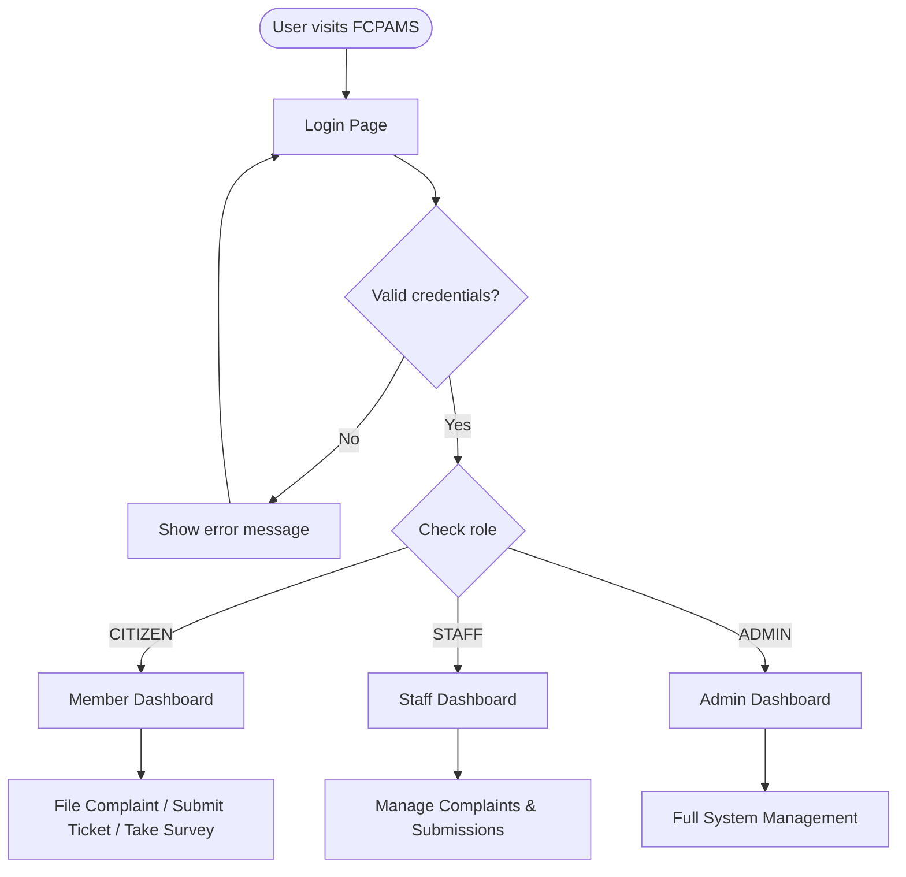
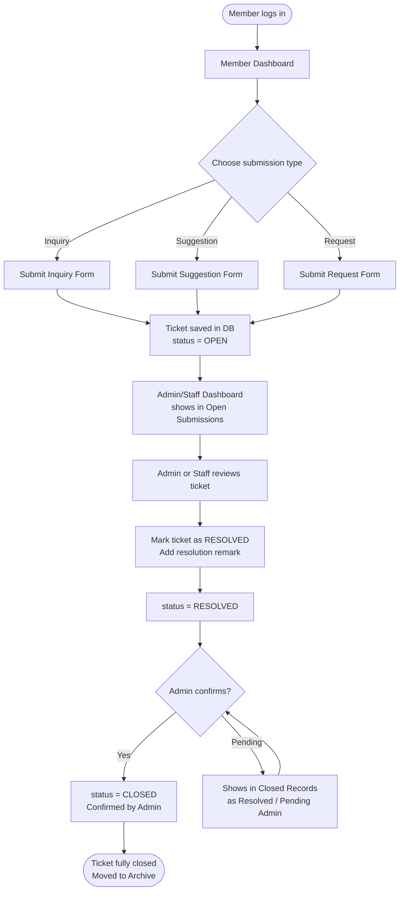
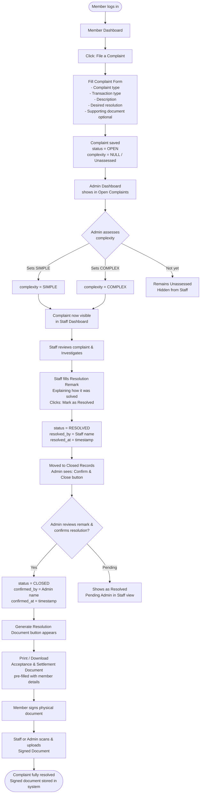
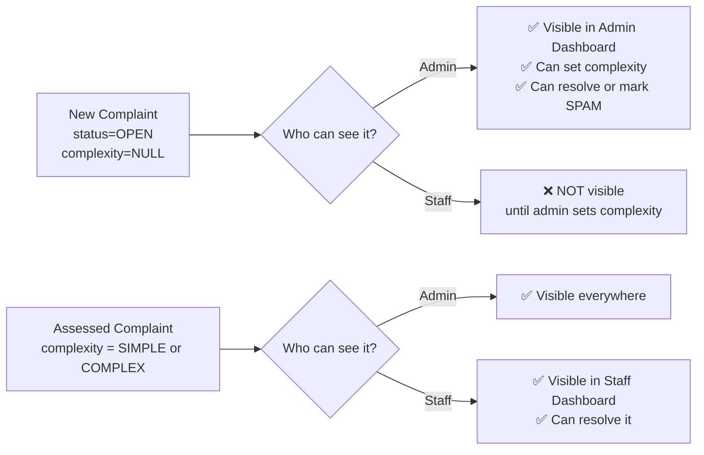
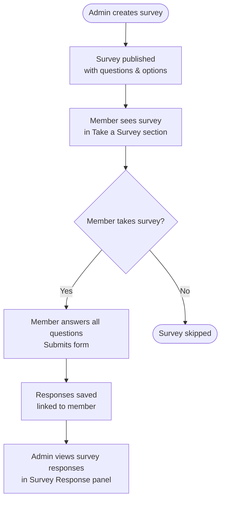

# FCPAMS — Feedback, Complaint, and Participation Administration Management System
## System Process Document & Flow Guide

**Organization:** Bansalan Cooperative  
**System Version:** 2.0  
**Document Type:** Process Flow Reference

---

## 1. System Overview

FCPAMS is a web-based management system that allows cooperative **Members (Citizens)** to submit inquiries, suggestions, requests, complaints, and surveys. **Staff** resolves cases, and **Admins** oversee, confirm, and archive all records.

---

## 2. Detailed Role Responsibilities & Problem-Solving

This section explains exactly what each role does and *how* they handle and solve problems within the system.

### 🙎‍♂️ Member (Citizen)
**Goal:** Report issues, seek assistance, and provide feedback.
- **Action - Filing:** Members use the dashboard to submit a detailed complaint or ticket. They select the category (e.g., Loan Processing, Customer Service) and describe the issue and their desired resolution.
- **Action - Providing Proof:** They optionally upload supporting documents (receipts, photos) to help staff understand the problem faster.
- **Action - Finalizing:** Once the cooperative solves the issue, the member physically signs the printed "Acceptance and Settlement of Complaint Resolution" document to signify agreement.

### 👨‍💻 Admin
**Goal:** Triage issues, oversee resolutions, enforce policy, and maintain records.
- **Problem Solving - Triage (Complexity Gating):** When a new complaint arrives, it is invisible to Staff. The Admin reads the complaint and determines its nature:
  - **SIMPLE:** Straightforward issues (e.g., inquiry about balance, minor delay) that staff can handle immediately.
  - **COMPLEX:** Serious issues (e.g., missing funds, harassment, major policy disputes) that require investigation or management intervention.
  - By setting the complexity, the Admin "assigns" the complaint to the Staff queue.
- **Problem Solving - Quality Control:** When Staff marks a complaint as "Resolved," the Admin reviews the staff's "Resolution Remark." The Admin checks if the solution follows cooperative policies.
- **Action - Archiving:** The Admin confirms the resolution (moving it to CLOSED), generates the official document, and uploads the scanned signed copy to finalize the record.

### 🧑‍💼 Staff
**Goal:** Investigate, communicate, and solve the actual problems reported by members.
- **Problem Solving - Investigation:** Staff monitor their dashboard for "Assessed" complaints (where Admin has set a complexity). They review the member's description and uploaded documents.
- **Problem Solving - Action:** Staff perform the actual legwork (often outside the system):
  - Contacting the specific branch involved.
  - Checking internal transaction logs or physical records.
  - Calling the member for clarification.
- **Problem Solving - Documentation:** Once a solution is reached (e.g., a refund is processed, an apology given, or an error corrected), the Staff writes a detailed **Resolution Remark** in the system. This remark explains *what* was done to solve the issue.
- **Action - Resolving:** Staff clicks "Mark as Resolved" which passes the complaint back to the Admin for final confirmation.

---

## 3. Authentication Flow



---

## 4. Submission (Ticket) Flow

Covers: **Inquiry, Suggestion, Request**



---

## 5. Complaint Flow *(Core Process)*



---

## 6. Complaint Visibility Rules



---

## 7. Survey Flow



---

## 8. Resolution Document Workflow

```mermaid
flowchart LR
    A[Complaint status = CLOSED] --> B[Generate Resolution Document\nbutton appears]
    B --> C[Open printable document\nbcheader.png + member details pre-filled]
    C --> D[Print / Download as PDF]
    D --> E[Member reads & signs\nphysical document]
    E --> F[Staff scans the signed document]
    F --> G[Upload via Upload button\nin complaints detail or Closed Records]
    G --> H[Signed doc stored at\nuploads/signed_docs/]
    H --> I[View Signed Doc button\nappears for Admin & Staff]
```



---

## 9. Status Lifecycle Reference

### Submission (Ticket) Statuses

```
OPEN  ──────►  RESOLVED  ──────►  CLOSED
       Staff/Admin        Admin Confirms
```

### Complaint Statuses

```
OPEN (Unassessed) ──► OPEN (Assessed) ──► RESOLVED ──► CLOSED
      complexity=NULL    Admin sets         Staff        Admin
                         complexity         resolves     confirms
```

> [!IMPORTANT]
> A complaint with `complexity = NULL` (Unassessed) is **invisible to Staff**. Admin must set the complexity before staff can process it.

### Special Status

```
OPEN / RESOLVED  ──►  SPAM
                  Admin marks as spam
                  (removes from main dashboard)
```

---

## 10. Complexity Rules

| Complexity | Set by | Meaning | Staff can see? |
|---|---|---|---|
| `NULL` / Unassessed | Default on new complaint | Not yet reviewed by admin | ❌ No |
| `SIMPLE` | Admin | Straightforward resolution | ✅ Yes |
| `COMPLEX` | Admin | Requires deeper investigation | ✅ Yes |

---

## 11. Report Module

| Report Type | Filters Available | Key Data Shown |
|---|---|---|
| **Complaints Report** | Status, Complexity, Branch, Date | Member, phone, complaint type, transaction, resolution remark, resolved by, confirmed by |
| **Submissions Report** | Type, Branch, Date, Status | Message, requester, ticket type, resolved by |
| **Surveys Report** | Survey, Date | Question responses, branch, member |

> [!TIP]
> All reports have a **Print / PDF** button. The page uses `@media print` to hide navigation elements and produce a clean A4 landscape printout.

---

## 12. File & Document Storage

| File Type | Location | Naming Convention |
|---|---|---|
| Supporting documents (complaints) | `uploads/` | `{timestamp}_{original_name}.{ext}` |
| Signed resolution documents | `uploads/signed_docs/` | `signed_complaint_{id}_{timestamp}.{ext}` |
| System header image | `images/bcheader.png` | Fixed |

**Accepted file types:** JPG, JPEG, PNG, PDF

---

*Document generated: April 28, 2026 — FCPAMS v2.0*
